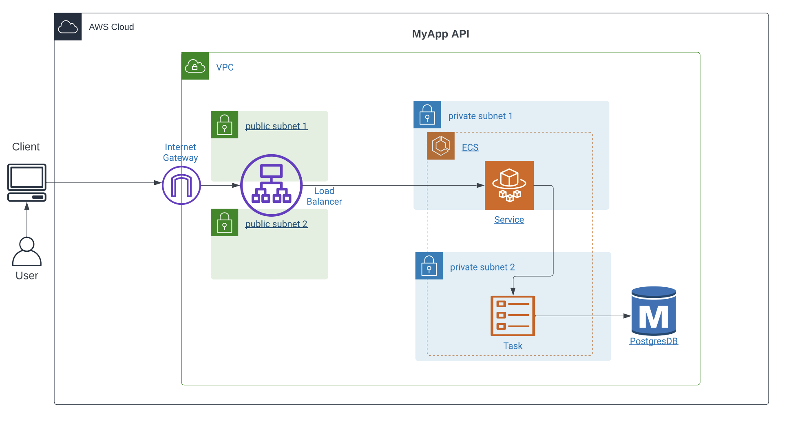
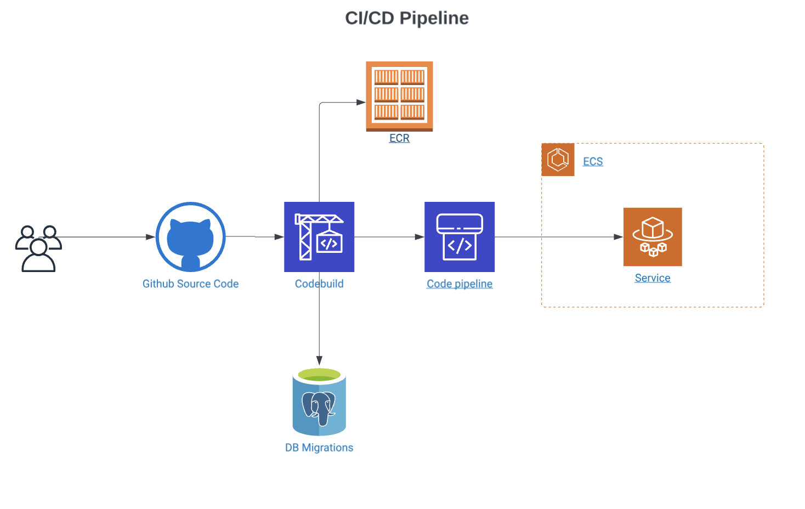

# myapp-terraform

This project is an entire Infraestructure and CI/CD setup for a typeorm-express-typescript application

Requirements

- Terraform 
- AWS CLI

 Workspaces

- create a new workspace `terraform workspace new ENV` ENV can be dev, stage, prod, etc.

Compenents used:

- ECS, RDS PostgreSQL, S3, VPC, etc.

- CI/CD Setup

Infraestructure diagram

CI/CD pipeline diagram

Monitoring and logging
- Cloudwatch 
- Cloudwatch Logs

Autoscaling
- ECS Service AutoScaling

